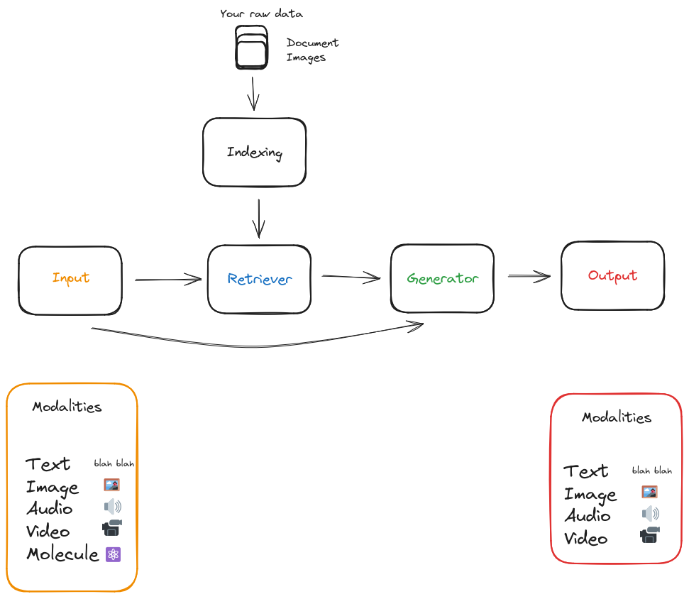
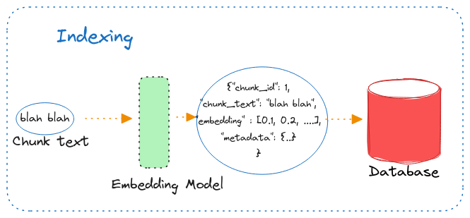
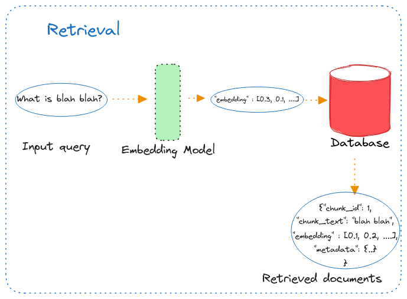

# 🔎 RAG Search Retrieval

In this project, we will experiment with search and retrieval approaches for an RAG application.

We will experiment with the following 3 retrieval approaches

1. Dense Retrieval
2. Sparse Retrieval
3. Full text Retrieval using BM-25

We will also create a hybrid retrieval from combination of above 3 approaches and combine results using 2 fusion approaches : RRF and Re-ranker.

# &#127939; How do I get started?

If you haven't already done so, please read [DEVELOPMENT.md](DEVELOPMENT.md) for instructions on how to set up your virtual environment using Poetry.

## 💻 Run Locally

> Note: Add a pdf dataset to the [data](rag_search_retrieval/data) folder.

```bash
poetry shell
poetry install
poetry run jupyter notebook
```

Once the notebook is up, make sure you update the `FILE_PATH` parameter value. Once the correct file path is set, click `Run -> Run all cells` option.

> It takes about 10 mins for everything to get completed if you have a Nvidia GPU.

Jump to the `Comparison` cell and toggle between different dropdown options to compare the results from various approaches.

# 💡 Background

Let’s take a look at what the architecture for a naive (query-)RAG looks like:



It consists of the following parts:

- **Indexing:** The raw documents are pre-processed, cleaned, and chunked to be indexed into a vector dataset. The text is chunked into smaller texts as it provides the right granularity and keeps the context of the text to be added to LLM limited in length. The quality of index construction determines whether the correct context can be obtained in the retrieval phase.

    The indexing phase can be run multiple times or once depending on the cadence of the raw input data.

**RAG Workflow**

Once we have completed the indexing phase, a typical RAG workflow looks like the following

1. **Input:** The user sends an input in the form of any input modality (text, image, video, etc).
2. **Retriever:** The user query is used by the retriever to fetch semantically similar documents to the query.
3. **Generator and Output:** The combination of the user query and the documents retrieved above to the LLM to get back the response.

Here we will **focus on how documents are stored in a database** and the second point of **how the retriever fetches semantically similar documents to user queries** and look if there are any better alternatives to fetch documents relevant to the user queries.

## Indexing



In our naive RAG, we pass the chunks through an embedding model to get a vector representation of the texts of the chunk. We store the combination of the text in chunks, its corresponding embedding vector, and metadata in a database.

Some questions that might arise in this phase are

- What is the optimal way to chunk the text documents? How to deal with multi-modal input?
- What is the best database to use? It can be a vector store or any other solution.
- What is the best embedding model to use?
- How to store and index the chunks in the database? It can be dense, sparse, etc.

> The chunks are stored in a database in several ways and these storing approaches decides how we can retrieve the relevant document from the database.

## Retrieval



To retrieve the documents relevant to the input query, we pass the input query through the **same embedding model** used in the Indexing/Storing phase mentioned above. The embedding vector for this input query is matched against all the entries inside the database. We can compare and score two dense vectors using various metrics such as cosine, euclidean, and inner product.

Some questions that might arise in this phase are

- What is the best embedding model to use? What distance metrics to use?
- Does this approach of Retrieval work in all cases? Where does it fail?
- What are other alternative options that can increase the probability of fetching the right documents?
